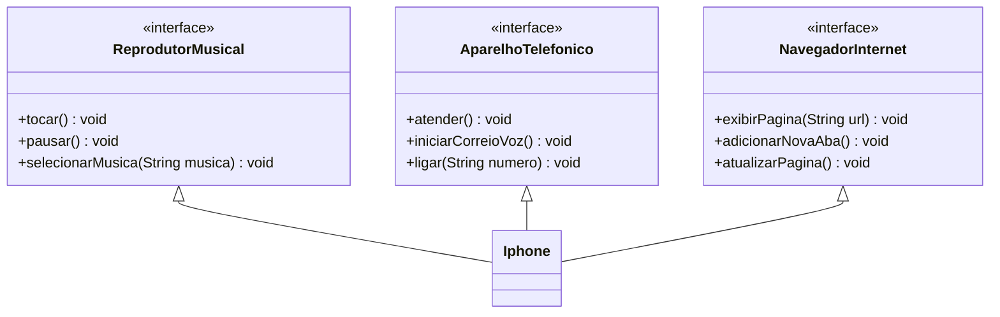

# Desafio de POO

Neste desafio, devo fazer uma diagramação em UML do fluxo de funcionamento do primeiro iPhone, conforme seu [vídeo de lançamento](https://www.youtube.com/watch?v=9ou608QQRq8).

Também me senti confiante e tomei a iniciativa de implementar minha diagramação num arquivo `.java` que pode ser visto no diretório `src`.

### Diagrama UML feito em [Mermaid](https://mermaid.js.org/)
